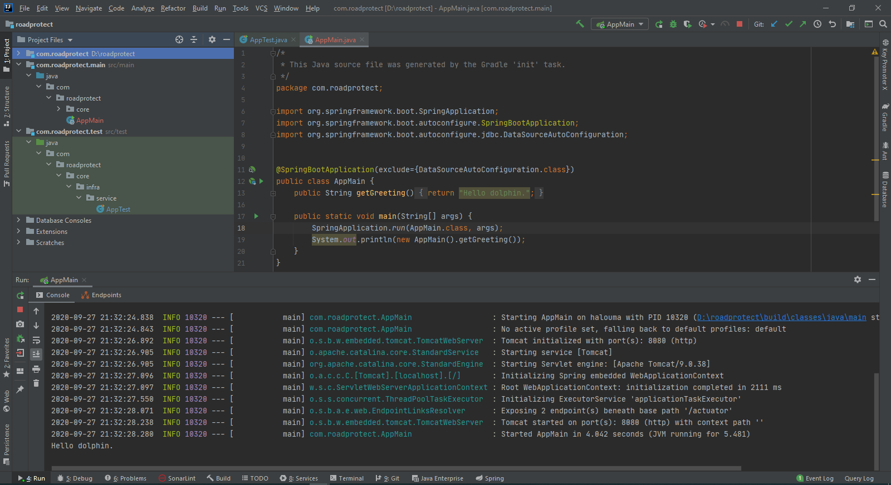

# com.smartmapper

# Context
l'Application "Smart Mapper" pour la gestion de mobilité".  
Suggestion d'itinéraires (réduire le temps d’attente) qui continuera à être utile en dehors du Covid (Pour l’aspect marketing).

# I - Description

# II - Lancement

## 1. Liste des end points

## 2. Prérequis

## 3. Exécution du service

# III - Captures

- 
