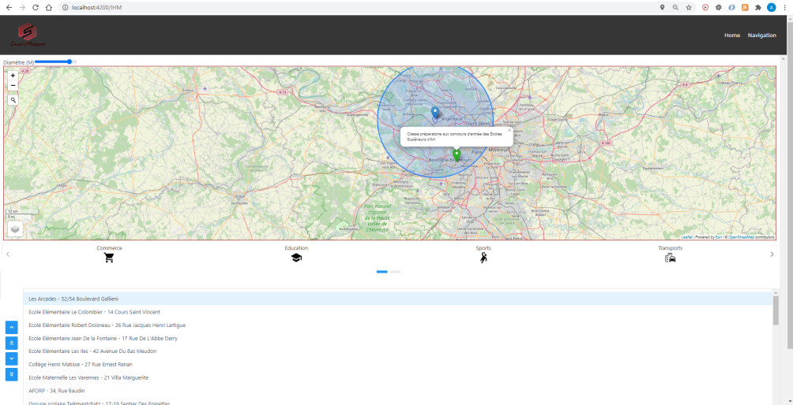
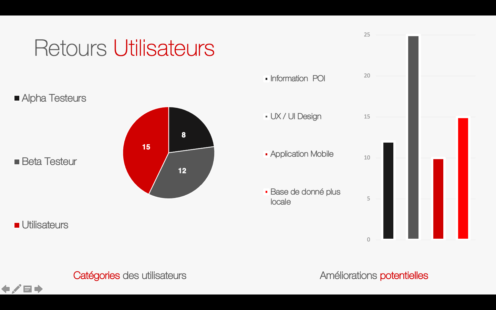

= SmartMapper DOC
Smart Mapper <SmartMapperProject@gmail.com>

== Utilisation et installation
=== Utilisation

Le projet SmartMapper une partie front _https://github.com/smartmapperproject/SmartMapperFrontend.git_
et une partie back _https://github.com/smartmapperproject/SmartMapperBackend_.

Le back est écrit en Java et quand au front il s'agit d'une application angular donc
vous devrez avoir sur votre machine une version assez récente de Java (8 minimum), gradle (6) ainsi que Node (14).

=== Installation
* FRONT:
Il suffira d'execute simplement la commande : *ng serve* pour lancer le serveur.
Naviguez vers http://localhost:4200/. L'application se rechargera automatiquement si vous modifiez l'un des fichiers sources.

* BACK :
Il suffira d'executer simplement la commande : *gradle clean build* pour lancer le serveur.
Une fois cela effectuer le serveur sera en marche et vous pourrz consulter la liste des End Points via _http://localhost:8080/swagger-ui.html_

== Les Fonctionalités de SmartMapper

Aujourd'hui avec la version V1.0 de SmartMapper on peut :

1. Avoir la possibilté d'être géolocalisé sur la carte grâce à un ping, via le navigateur internet.

2. Avoir un apercu d'un itinéraire entre un point de départ (A) et d'arrivée (B) ainsi que les routes à emprunter, tout en ayant la possibilté de rajouter d'autres "étapes" sur le chemin.

3. Avoir l'emplacement d'un point d'intérêt (POI) le plus proche de notre point de départ ou d'arrivée et cela sur de nombreuses catégories (fleuristes, boulageries, lieux de cultes, écoles, supermachés etc...).

== Scénario d'utilisation
=== Cas Numéro 1:
Je souhaite aller de cher moi à l'université de Nanterre et savoir si en cette peridode de confinement mon déplacement
est autorisé par rapport aux règles de la COVID-19, pour cela je me rend sur l'application SmartMapper je renseigne moint point de départ (ou géolocalisation)
mon point d'arrivé et je valide. Dès lors je vois l'itinéraire s'afficher, si il se trouve dans un rayon autorisé le gouvernement, représenté par un cercle (bleu si valide, rouge sinon) sur la carte,
je peux me rendre à ma destination.

=== Cas Numéro 2:
Je souhaite aller d'un point A un point B en passant par un point d'intérêt (C) le plus
proche de moi, pour cela je me rend sur l'application, je configure mon itinéraire et j'appuie sur le
logo correspondant à la catégorie recherché. Dès lors je vois sur la carte un ping m'indiquant
le point le plus proche de ma position.

== Routes et End Points

Nous aurons quatre services principaux :

* Service USER
* Service ITINERAIRE
* Service POINT INTERET
* Service STATISTIQUE

==== SERVICE USER
****
POST / GET / PUT / DELETE
****
|===
|URL |METHODE |ACTION

|/user
|Post
|Céation d'un utilisateur

|/user
|Get
|Récupérer la liste des utilisateurs créés

|/user/{id}
|Get
|Récupérer les infos d'un utilisateur

|/user/{id}/itinéraires
|Get
|Récupérer l’historique des itinéraires d’un user

| /user/{id}/adresses
|Get
|Récupérer les lieux enregistrés d’un user

|/user/{id}
|Put
|Mettre à jour les infos d'un utilisateur

|/user{id}
|Delete
|Supprimer un utilisateur

|===
==== SERVICE ITINERAIRE
****
POST / GET / PUT / DELETE
****

|===
|URL |METHODE |ACTION

|/itineraire
|Post
|Créer un itinéraire

|/itinéraire/{id}
|Put
|Modifier un itinéraire

|/itinéraire
|Get
|Récupérer les itinéraires créer

|/itinéraire/{id}
|Get
|Récupérer un itinéraire

|/itinéraire/{id}
|Delete
|Supprimer un itinéraire

|===

==== SERVICE POINT INTERET
****
POST / GET / PUT / DELETE
****
|===
|URL |METHODE |ACTION

|/point
|Post
|Créer un point d'intérêt

|/point-interet
|Get
|Récupérer les points créés

|/point-interet/{id}
|Get
|Récupérer les infos d'un point

|"/point-interet/categorie/{categorie}
|Get
|Récupérer les points d'une categorie

|"/point-interet/{id}/categorie"
|Get
|Récupérer les categories d'un point

|/point-interet/{id}
|Put
|Modifier les infos d'un point
(mettre en fav, mettre en adresse perso, note..., pas les coordonnées)

|/point-interet
|Delete
|Supprimer un point d'intérêt

|===

==== SERVICE STATISTIQUE
****
POST / GET / PUT / DELETE
****

|===
|URL |METHODE |ACTION

|/métrique
|Post
|Créer un métrique

|/métrique
|Get
|Récupérer la liste des métriques

| /métrique/{id}
|Get
|Récupérer une métrique

|/métrique/{id}
|Put
|Modifier une métrique

|/métrique/{id}
|Delete
|Supprimer une métrique

|===
Ci-dessous une liste des "endpoints" provenant de l'API Swagger

== Diagramme de classes
image::../diagram.svg[Diagramme de classe du projet]

== Diagramme de Séquence

== Site Web Projet

_https://smartmapperproject.github.io/SmartMapperFrontend/_

== Retours & Feedback

== Burndown Chart 

