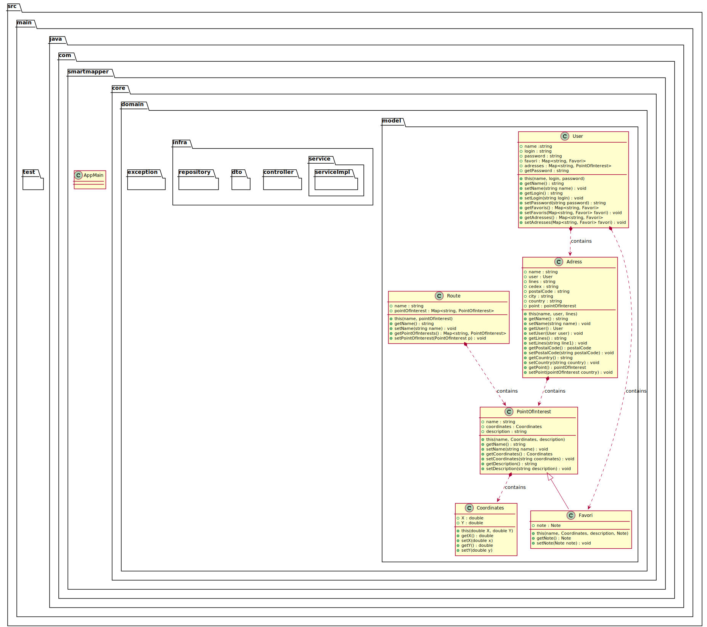

= SmartMapper DOC
Smart Mapper <SmartMapperProject@gmail.com>

== Utilisation et installation
=== Utilisation

Le projet SmartMapper une partie front _https://github.com/smartmapperproject/SmartMapperFrontend.git_
et une partie back _https://github.com/smartmapperproject/SmartMapperBackend_.

Le back est écrit en Java et quand au front il s'agit d'une application angular donc
vous devrez avoir sur votre machine une version assez récente de Java (8 minimum), gradle (6) ainsi que Node (14).

=== Installation
* FRONT:
Il suffira d'execute simplement la commande : *ng serve* pour lancer le serveur.
Naviguez vers http://localhost:4200/. L'application se rechargera automatiquement si vous modifiez l'un des fichiers sources.

* BACK :
Il suffira d'executer simplement la commande : *gradle clean build* pour lancer le serveur.
Une fois cela effectuer le serveur sera en marche et vous pourrz consulter la liste des End Points via _http://localhost:8080/swagger-ui.html_

== Routes et End Points

Nous aurons quatre services principaux :

* Service USER
* Service ITINERAIRE
* Service POINT INTERET
* Service STATISTIQUE

==== SERVICE USER
****
POST / GET / PUT / DELETE
****
|===
|URL |METHODE |ACTION

|/user
|Post
|Céation d'un utilisateur

|/user
|Get
|Récupérer la liste des utilisateurs créés

|/user/{id}
|Get
|Récupérer les infos d'un utilisateur

|/user/{id}/itinéraires
|Get
|Récupérer l’historique des itinéraires d’un user

| /user/{id}/adresses
|Get
|Récupérer les lieux enregistrés d’un user

|/user/{id}
|Put
|Mettre à jour les infos d'un utilisateur

|/user{id}
|Delete
|Supprimer un utilisateur

|===
==== SERVICE ITINERAIRE
****
POST / GET / PUT / DELETE
****

|===
|URL |METHODE |ACTION

|/itineraire
|Post
|Créer un itinéraire

|/itinéraire/{id}
|Put
|Modifier un itinéraire

|/itinéraire
|Get
|Récupérer les itinéraires créer

|/itinéraire/{id}
|Get
|Récupérer un itinéraire

|/itinéraire/{id}
|Delete
|Supprimer un itinéraire

|===

==== SERVICE POINT INTERET
****
POST / GET / PUT / DELETE
****
|===
|URL |METHODE |ACTION

|/point
|Post
|Créer un point d'intérêt

|/point-interet
|Get
|Récupérer les points créés

|/point-interet/{id}
|Get
|Récupérer les infos d'un point

|"/point-interet/categorie/{categorie}
|Get
|Récupérer les points d'une categorie

|"/point-interet/{id}/categorie"
|Get
|Récupérer les categories d'un point

|/point-interet/{id}
|Put
|Modifier les infos d'un point
(mettre en fav, mettre en adresse perso, note..., pas les coordonnées)

|/point-interet
|Delete
|Supprimer un point d'intérêt

|===

==== SERVICE STATISTIQUE
****
POST / GET / PUT / DELETE
****

|===
|URL |METHODE |ACTION

|/métrique
|Post
|Créer un métrique

|/métrique
|Get
|Récupérer la liste des métriques

| /métrique/{id}
|Get
|Récupérer une métrique

|/métrique/{id}
|Put
|Modifier une métrique

|/métrique/{id}
|Delete
|Supprimer une métrique

|===

== Diagramme de classes

== Site Web Projet

_https://smartmapperproject.github.io/SmartMapperFrontend/_